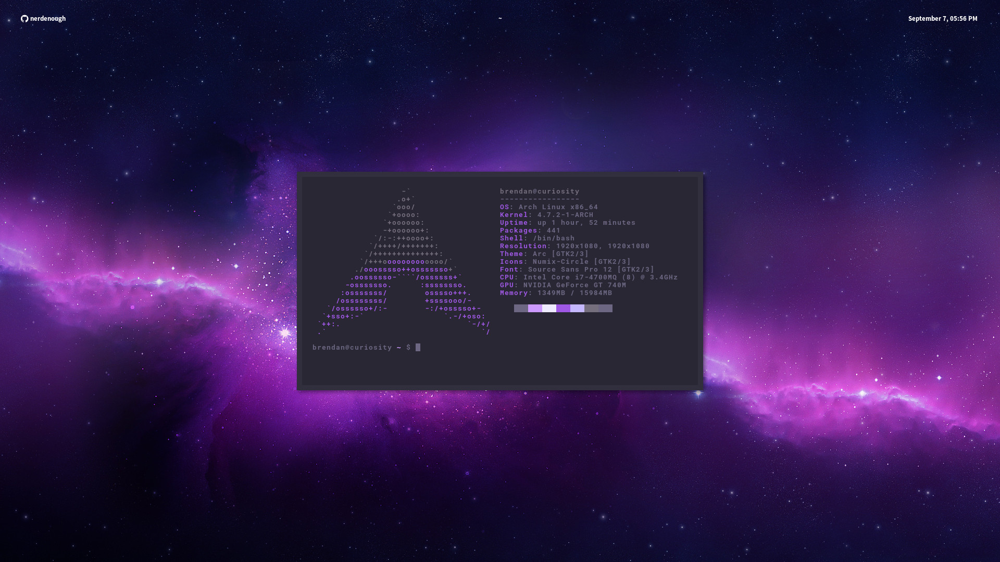
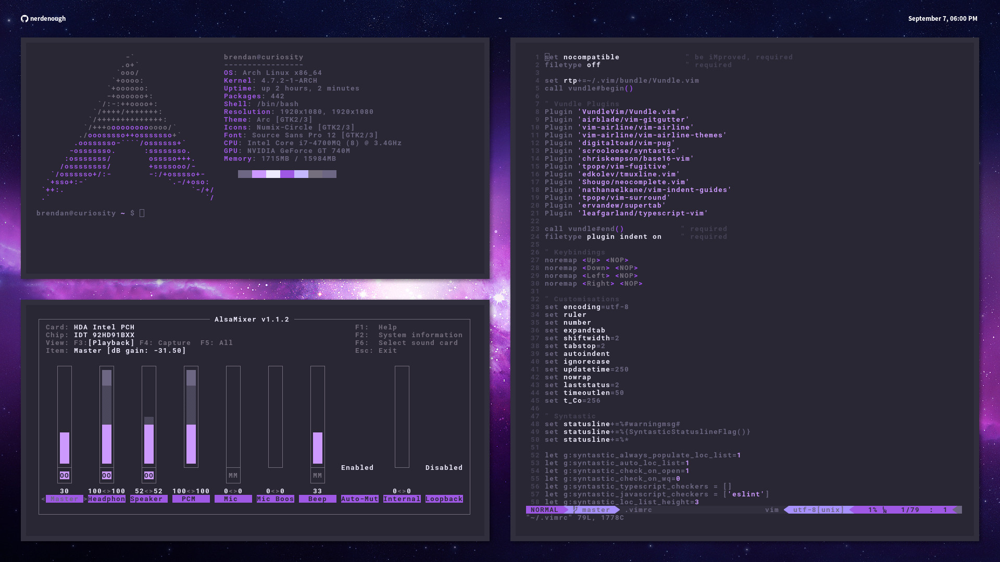

# Dotfiles
This repository contains all of my dotfiles for my Arch Linux and macOS
installations.

## Arch Linux (BSPWM)
### Screenshots

### Details
- Colour scheme: [Duotone Dark Amethyst Syntax](https://atom.io/themes/duotone-dark-amethyst-syntax)
- Wallpaper: [Purple Nebula](http://img.wallpaperfolder.com/f/7B81910DEBBB/noname.jpg)

*Note:* I converted the Duotone Dark Amethyst Syntax theme to shell/xresources
using [duotone-base16](https://github.com/nerdenough/duotone-base16) and
[base16-builder-php](https://github.com/chriskempson/base16-builder-php).
